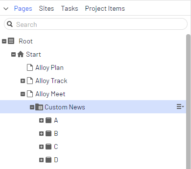
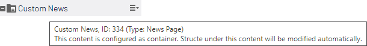
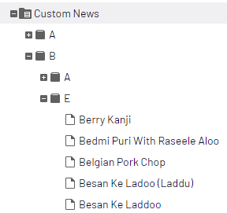
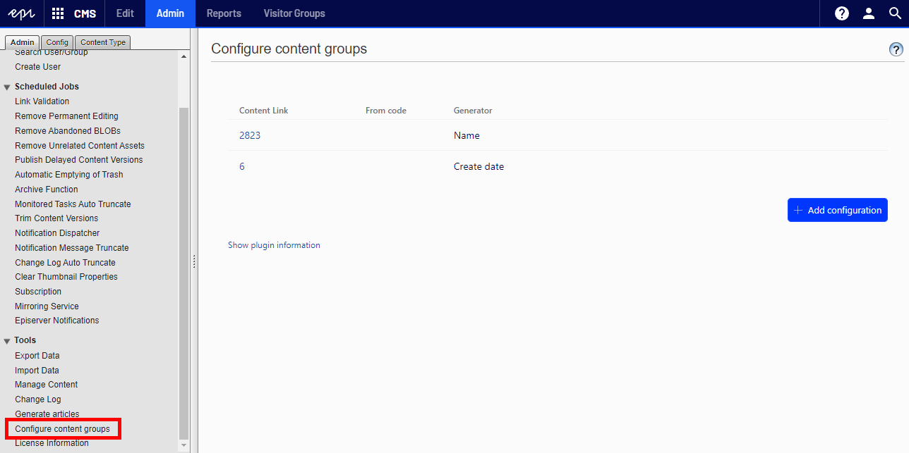
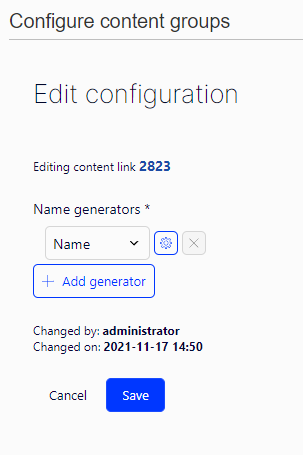
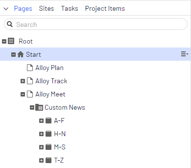
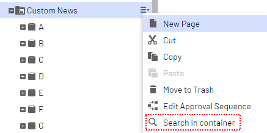
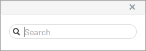
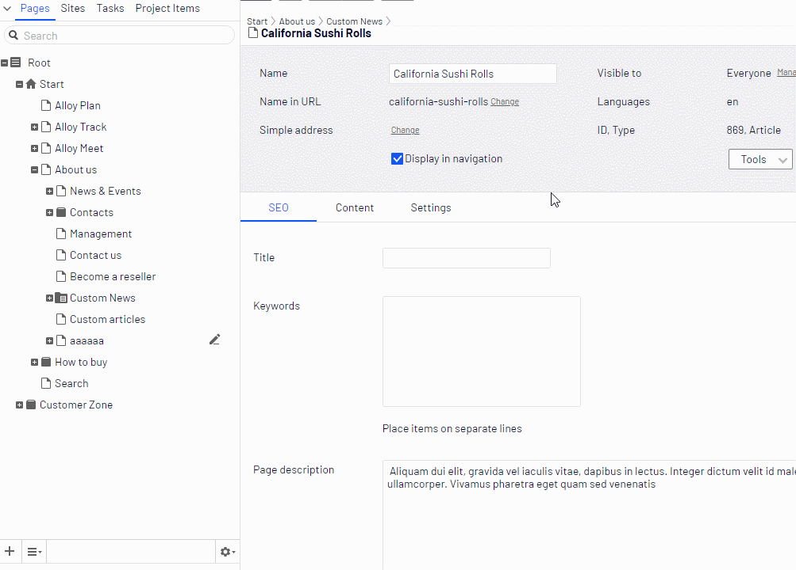
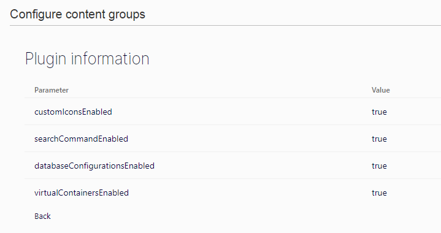

# Virtual containers

Virtual containers is an [Optimizely](https://www.optimizely.com/) addon that allows to group page children.



Plugin allows defining rules for grouping page children. It allows to define more than one configuration for site. 

The virtual container pages has no representation in the database, but they just displayed in Edit Mode.

The concept of Virtual Containers:
* they doesn't affect the view mode – this is the biggest advantage. There is no partial router and no strange parts of the URL
* we can change structure back and forth with no need to rebuild physical pages, and no risk that we break something
* it can be turned off and on at any time
* they can’t be clicked, drag and drop, selected, etc. They are used only to group children in page tree
 
## Install

```
Install-Package ContentChildrenGrouping.VirtualContainers
```
## Getting started

To add a configuration from code you can use `InitilizableModule`:

```
namespace AlloySample.Business.Initialization
{
    [ModuleDependency(typeof(EPiServer.Web.InitializationModule))]
    public class ContentGroupingInitialization : IInitializableModule
    {
        public void Initialize(InitializationEngine context)
        {
            var containerPageLink = ... // locate parent page link ContentReference
            context.Locate.Advanced.GetInstance<IContentChildrenGroupsRegistration>().RegisterByLetter(containerPageLink);
        }

        public void Uninitialize(InitializationEngine context) { }
    }
}
```

Otherwise, configuration can be added with Admin mode plugin.

## How does it look like

When page has related configuration the icon and tooltip in Edit mode will change. Editor will see that page is a Container root and should not create container pages manually.



Virtual containers also has a different icon, they can’t be used as regular pages – they have no context menu, can’t be clicked, D&D to content areas, moved, etc.

## Types of generators

Virtual containers names are not limited to first letter of content name only. The parent container name is calculated based on processed Content. It can be a part of the content name, created date or any custom value.

There are few built-in generator types that I think can be commonly used:
* **Name** – groups pages by part of the page name. By default, it is first letter, but it can be any part of the content name string. Generator has 3 input parameters, start index and length determinates the part of the content name used to build container name. DefaultValue – it will be used as container name, when name can’t be generated, for example when content name is too short. Name generator supports Unicode names.
* **Created Date** – group pages by page created date, with provided format. For example „yyyy” will group pages by year. It has two parameters, "DateFormat" is the format of date used to create container name. “DefaultValue” is used to create container name when content does not implement IChangeTrackable interface and there is no CreatedDate property.
* **Expression** – developer can provide custom expression. The only parameter is “expression” function that returns container name from Content. This generator is not available in database configuration.

## Nested structure

Addon can also handle scenarios when one level of containers is not enough. That’s why configuration class has list of generators. That allows creating structure with as much nested containers as needed.



## Configuring containers from code

Registering containers requires only few lines of code. For example we can use InitialzableModule and extension methods from IContentChildrenGroupsRegistration interface.

```
[InitializableModule]
[ModuleDependency(typeof(EPiServer.Web.InitializationModule))]
public class DisplayRegistryInitialization : IInitializableModule
{
    public void Initialize(InitializationEngine context)
    {
	    // register by letter
        var containerContentLink1 = ... // resolve container content link
		context.Locate.Advanced.GetInstance<IContentChildrenGroupsRegistration>().RegisterByLetter(containerContentLink1);
        
		// register by created date
        var containerContentLink2 = ... // resolve container content link
		context.Locate.Advanced.GetInstance<IContentChildrenGroupsRegistration>().RegisterByCreateDate(containerContentLink2);
    }

    public void Preload(string[] parameters){}

    public void Uninitialize(InitializationEngine context){}
}
```

In the code above I registered two containers, one which will group pages by letter and second which will group by created date.

There is also more generic method that allows registering container using „ContainerConfiguration” object:

```
[InitializableModule]
[ModuleDependency(typeof(EPiServer.Web.InitializationModule))]
public class DisplayRegistryInitialization : IInitializableModule
{
    public void Initialize(InitializationEngine context)
    {
        context.Locate.Advanced.GetInstance<IContentChildrenGroupsRegistration>().Register(
            new ContainerConfiguration
            {
                ContainerContentLink = new ContentReference(111),
                GroupLevelConfigurations = new IGroupNameGenerator[]
                {
                    new ByNameGroupNameGenerator(0, 1),
                    new ByCreateDateGroupNameGenerator("yyyy"),
                }
            });
    }

    public void Preload(string[] parameters){}

    public void Uninitialize(InitializationEngine context){}
}
```

In the code above I registered nested structure of containers, first level by content name first letter, then second by page created date year.

## Admin mode plugin

Admin plugin allows registering container configurations during runtime. Configurations are stored in DDS.

Plugin is available under Tools -> Configure Content Groups.

It lists both database configurations and configurations added from code (they are not editable).



Plugin allows to set same fields are configurations added from code.



## Custom generators

If none of built-in generators fits to site structure, we can create a custom generator. It has to implement IGroupNameGenerator interface. Interface has only one method GetName which returns name for a container when Content is saving.

```
public interface IGroupNameGenerator
{
    string GetName(IContent content);
}
```

We can for example try to implement range generator.

Range generator will allow grouping children by first letter, but in more specific way than default name generator. All pages that has name starting from letters from A to F should be in “A-F” group, from H to N in “H-N” group and so on.

To achieve this we need to create a RangeGenerator class:

```
public class RangeGenerator: IGroupNameGenerator
{
    public string GetName(IContent content)
    {
        if (content.Name.Length == 0)
        {
            return "!default";
        }

        var name = content.Name.ToLower()[0];
        if (name <= 'g')
        {
            return "A-F";
        }

        if (name >= 'h' && name <= 'n')
        {
            return "H-N";
        }

        if (name >= 'm' && name <= 's')
        {
            return "M-S";
        }

        return "T-Z";
    }
}
```

And then register container using InitializableModule:

```
[ModuleDependency(typeof(EPiServer.Web.InitializationModule))]
public class ContentGroupingInitialization : IInitializableModule
{
    public void Initialize(InitializationEngine context)
    {
            context.Locate.Advanced.GetInstance<IContentChildrenGroupsRegistration>()
                .Register(new ContainerConfiguration(new ContentReference(2823), new RangeGenerator()));
    }

    public void Uninitialize(InitializationEngine context) { }
}
```

After running the code we should see grouped content.



## Search command

One last small feature is extra search command. It’s available under configured container pages context menu.



After clicking this command Editor will see dialog with search field:



that allows to search children, but only under container:



As you can see virtual containers are not listed in search result.

## Options

Plugin has few global settings, that can be changed using options. Most of them are switches, that allow to turn off some unwanted functionalities. 

| Option        | Type    | Default           | Description  |
 | ---- | ---- | ---- | ---- |
 | Enabled | boolean | true | When true then Virtual containers are enabled |
 | DatabaseConfigurationsEnabled | boolean | true | When true, then containers can be configured using admin plugin.<br><br>When all configurations are from code, this option can be set to false to improve loading configurations performance. |
 | CustomIconsEnabled | boolean | true | When true, then container icon is replaced with custom icon. |
 | SearchCommandEnabled | boolean | true | When true, then search commands are available in page tree. |

Options can be configured using configuration module.

```
[ModuleDependency(typeof(EPiServer.Web.InitializationModule))]
public class ContentGroupingInitialization : IConfigurableModule
{
    public void ConfigureContainer(ServiceConfigurationContext context)
    {
        context.Services.AddTransient(serviceLocator => new VirtualContainersOptions
        {
            Enabled = true,
            DatabaseConfigurationsEnabled = true,
            SearchCommandEnabled = true,
            CustomIconsEnabled = true
        });
    }

    public void Initialize(InitializationEngine context) { }

    public void Uninitialize(InitializationEngine context) { }
}
```

In admin mode plugin there is “Show plugin information” where you can check the current configuration.


